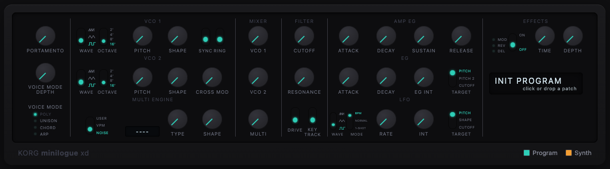

# minilogue xd viewer

View, audition, and re-synthesize Korg minilogue xd patches.

**Live:** https://minilogue-xd-viewer.vercel.app/



- Load `.mnlgxdprog` / `.mnlgxdlib` files and inspect every parameter on a faithful panel.
- Mirror a connected minilogue xd live over Web MIDI (Chrome/Edge).
- **Resynthesis** — match an audio clip to a patch with the built-in model or Gemini (your own API key), then load it onto the hardware.

## Ableton extension

A viewer-only build runs inside Ableton Live 12.4.5+. Download the latest `.ablx` from the
[Releases page](../../releases) and add it via **Settings → Extensions → Add**. Re-synthesis
opens in your browser.

## Development

Requires Node 24.

```sh
# web app
cd web && corepack pnpm install && corepack pnpm dev

# ableton extension
cd ableton && npm install && npm start   # dev-load into Live
cd ableton && npm run package            # build dist/minilogue-xd-viewer.ablx
```

`training/` holds the Python model + dataset/eval tooling for the built-in matcher.
